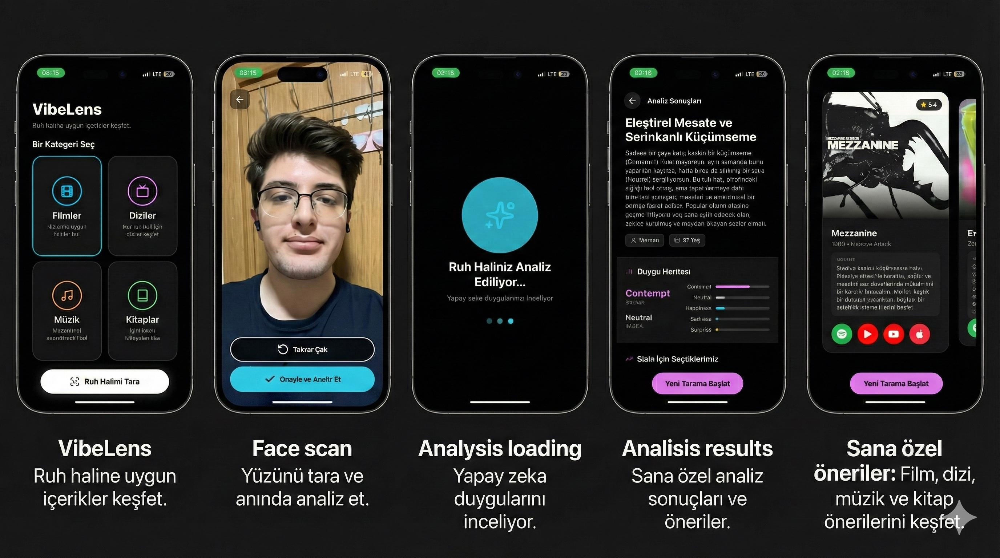
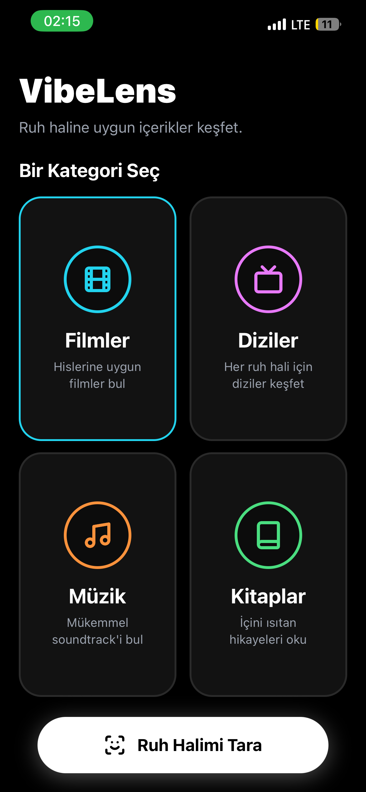

# VibeLens Mobile Client

Yapay zeka destekli yüz analizi ile anlık duygu durumunu tespit eden ve kullanıcıya uygun Film, Dizi, Müzik veya Kitap önerileri sunan React Native uygulaması.

[](https://expo.dev/)
[](https://reactnative.dev/)
[](https://www.typescriptlang.org/)
[](https://www.nativewind.dev/)



---

## Proje Hakkında

VibeLens, kullanıcıların selfie çekerek o anki duygusal durumlarını analiz etmelerini sağlayan bir mobil istemcidir. Uygulama, arka planda çalışan Python tabanlı bir API ile iletişim kurarak yüz ifadelerinden baskın ve ikincil duyguları tespit eder. Analiz sonucuna göre kürate edilmiş içerik önerileri sunar.

Arayüz tasarımı karanlık mod (dark mode) esas alınarak geliştirilmiş olup, NativeWind kullanılarak şekillendirilmiştir.

---

## Özellikler

* **Duygu Analizi:** Yüz ifadelerinden baskın (örn: Mutluluk) ve ikincil (örn: Heyecan) duyguların tespiti.
* **Kamera Arayüzü:** Yüz hizalama kılavuzları içeren özelleştirilmiş kamera modülü.
* **İçerik Önerileri:** Tespit edilen ruh haline uygun film, dizi, müzik ve kitap tavsiyeleri.
* **Kullanıcı Arayüzü:** Neon vurgulara sahip modern ve minimalist tasarım.
* **Performans:** Expo Router ile dosya tabanlı yönlendirme ve Zustand ile durum yönetimi.

---

## Ekran Görüntüleri

| Ana Ekran | Kamera | Önizleme |
|:---:|:---:|:---:|
|  |  |  |

| Analiz Süreci | Sonuçlar (Detay) | Sonuçlar (Öneri) |
|:---:|:---:|:---:|
|  |  |  |

---

## Teknoloji Yığını

* **Framework:** React Native (Expo SDK 50+)
* **Dil:** TypeScript
* **Stil:** NativeWind (Tailwind CSS)
* **Navigasyon:** Expo Router
* **Durum Yönetimi:** Zustand
* **Ağ İstekleri:** Axios

---

## Kurulum

Projeyi yerel ortamda çalıştırmak için aşağıdaki adımları takip edin.

### Gereksinimler

* Node.js (LTS sürümü önerilir)
* Expo Go uygulaması (Fiziksel cihaz testi için) veya iOS Simulator / Android Emulator

### Adımlar

1. Repoyu klonlayın:
   ```bash
   git clone [https://github.com/kullaniciadi/vibelens-mobile.git](https://github.com/kullaniciadi/vibelens-mobile.git)
   cd vibelens-mobile

```

2. Bağımlılıkları yükleyin:
```bash
npm install
# veya
yarn install

```


3. Çevresel değişkenleri yapılandırın:
Kök dizinde `.env` dosyası oluşturun ve API adresini tanımlayın.
```env
EXPO_PUBLIC_API_URL=http://LOCALHOST_IP:8000
EXPO_PUBLIC_USE_MOCK_DATA=false

```


4. Uygulamayı başlatın:
```bash
npx expo start

```


---

## Proje Yapısı

Proje, Expo Router yapısına uygun olarak düzenlenmiş olup, kaynak kodları `src` dizini altında modüler hale getirilmiştir.

```text
VibeLens-Frontend/
├── app/                      # Expo Router sayfa ve yönlendirme tanımları
│   ├── (tabs)/               # Alt navigasyon sekmeleri (varsa)
│   ├── _layout.tsx           # Ana düzen ve provider tanımları
│   ├── analyzing.tsx         # Analiz animasyon ekranı
│   ├── camera.tsx            # Fotoğraf çekim ekranı
│   ├── index.tsx             # Karşılama ve kategori seçim ekranı
│   ├── modal.tsx             # Modal pencereler
│   └── results.tsx           # Analiz sonuçları ve öneri ekranı
├── src/                      # Uygulama mantığı ve yardımcı dosyalar
│   ├── components/           # Yeniden kullanılabilir UI bileşenleri
│   ├── constants/            # Tema, renkler ve sabit veriler
│   ├── screens/              # Sayfa özelindeki mantıksal bileşenler
│   ├── services/             # API çağrıları ve dış servis entegrasyonları
│   ├── store/                # Zustand durum yönetimi (State management)
│   └── types/                # TypeScript tip tanımları
├── components/               # Proje genelinde kullanılan temel UI elementleri
├── assets/                   # Görseller ve font dosyaları
└── docs/                     # Dokümantasyon materyalleri

```

---

## Lisans

Bu proje MIT lisansı altında dağıtılmaktadır.