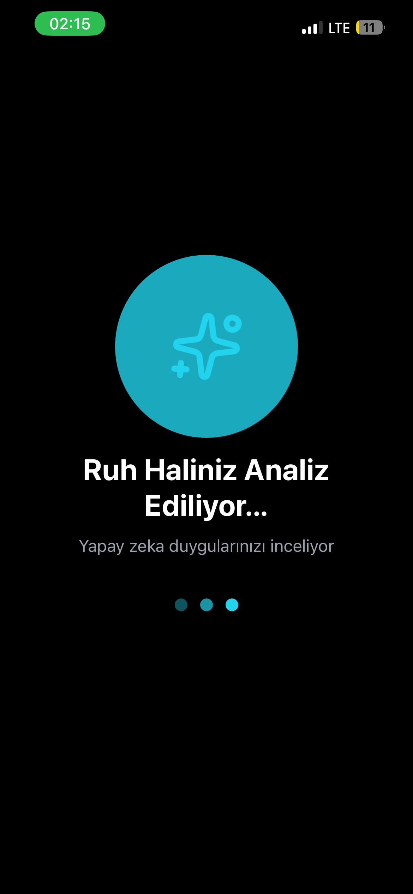
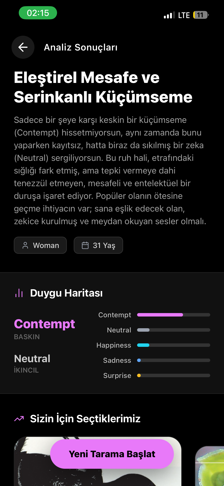
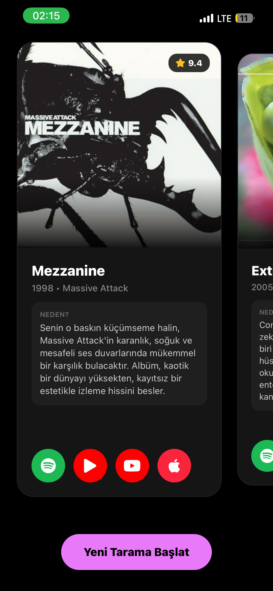

Harika! Elindeki ekran görüntüleri ve proje detaylarına dayanarak, GitHub veya proje dokümantasyonu için profesyonel, modern ve açıklayıcı bir **README.md** dosyası hazırladım.

Bu dosya, projenin **Frontend (Mobil)** tarafını temsil eder. Ekran görüntülerini projenin içine `docs/screenshots` klasörüne koyduğunu varsayarak yolları ayarladım.

Aşağıdaki kodu kopyalayıp projenin kök dizinine `README.md` olarak kaydedebilirsin.

---

```markdown
# 📸 VibeLens Mobile Client


> **Ruh haline uygun içerikler keşfet.** > Yapay zeka destekli yüz analizi ile anlık duygu durumunuzu tespit eden ve size en uygun Film, Dizi, Müzik veya Kitap önerileri sunan React Native uygulaması.

[](https://expo.dev/)
[](https://reactnative.dev/)
[](https://www.typescriptlang.org/)
[](https://www.nativewind.dev/)

---

## 📱 Proje Hakkında

**VibeLens**, kullanıcıların selfie çekerek o anki duygusal durumlarını (Mutluluk, Üzgünlük, Öfke, Küçümseme vb.) analiz etmelerini sağlar. Arka planda çalışan güçlü bir Python API (DeepFace & Gemini AI) ile iletişim kurarak, tespit edilen duyguya özel kürate edilmiş içerik önerileri sunar.

Uygulama, **Cyberpunk/Dark Mode** estetiği ile tasarlanmış olup, akıcı animasyonlar ve modern bir kullanıcı deneyimi sunar.

---

## ✨ Özellikler

* **🎭 AI Destekli Duygu Analizi:** Yüz ifadelerinden baskın ve ikincil duyguları (örn: *Eleştirel Mesafe ve Serinkanlı Küçümseme*) tespit eder.
* **📷 Gelişmiş Kamera Arayüzü:** Yüz çerçeveleme kılavuzları ile entegre kamera deneyimi.
* **🎯 Dinamik Öneriler:**
    * 🎬 Filmler
    * 📺 Diziler
    * 🎵 Müzik
    * 📚 Kitaplar
* **💅 Modern UI/UX:** NativeWind ile oluşturulmuş, Neon vurgulu şık karanlık mod tasarımı.
* **⚡ Performans:** Expo Router ile hızlı sayfa geçişleri ve Zustand ile optimize edilmiş durum yönetimi.

---

## 🖼️ Ekran Görüntüleri

| **Ana Ekran** | **Kamera & Tarama** | **Önizleme & Onay** |
|:---:|:---:|:---:|
|  |  |  |
| *Kategori Seçimi* | *Yüz Tespiti* | *Fotoğraf Onayı* |

| **Yükleniyor** | **Sonuçlar (Analiz)** | **Sonuçlar (Öneri)** |
|:---:|:---:|:---:|
|  |  |  |
| *AI Analiz Süreci* | *Duygu Raporu* | *İçerik Önerisi* |

---

## 🛠️ Teknoloji Yığını

* **Framework:** React Native (via Expo)
* **Dil:** TypeScript
* **Styling:** NativeWind (Tailwind CSS)
* **Navigasyon:** Expo Router (File-based routing)
* **State Management:** Zustand
* **Networking:** Axios
* **Icons:** Lucide React Native
* **Fonts:** Custom Google Fonts (Inter / Poppins)

---

## 🚀 Kurulum ve Çalıştırma

Projeyi yerel ortamınızda çalıştırmak için aşağıdaki adımları izleyin.

### Ön Hazırlık

* Node.js (v18+)
* Expo Go (Mobil cihazınızda) veya iOS Simulator / Android Emulator

### Adım 1: Repoyu Klonlayın

```bash
git clone [https://github.com/kullaniciadi/vibelens-mobile.git](https://github.com/kullaniciadi/vibelens-mobile.git)
cd vibelens-mobile

```

### Adım 2: Bağımlılıkları Yükleyin

```bash
npm install
# veya
yarn install

```

### Adım 3: Çevresel Değişkenleri Ayarlayın

Kök dizinde `.env` dosyası oluşturun ve backend API adresinizi girin:

```env
EXPO_PUBLIC_API_URL=http://YOUR_LOCAL_IP:8000
EXPO_PUBLIC_USE_MOCK_DATA=false

```

### Adım 4: Uygulamayı Başlatın

```bash
npx expo start

```

QR kodu telefonunuzdaki **Expo Go** uygulaması ile taratın veya `i` tuşuna basarak iOS Simulator'da başlatın.

---

## 📂 Proje Yapısı

```
VibeLensMobile/
├── app/                 # Expo Router sayfaları (Screens)
│   ├── (tabs)/          # Tab navigasyonu (varsa)
│   ├── camera/          # Kamera ve Tarama ekranları
│   ├── results/         # Sonuç ekranları
│   └── index.tsx        # Ana giriş
├── src/
│   ├── components/      # Yeniden kullanılabilir UI bileşenleri
│   │   ├── Button.tsx
│   │   ├── MoodCard.tsx
│   │   └── ...
│   ├── services/        # API servisleri (api.ts)
│   ├── stores/          # Zustand store'ları (useMoodStore.ts)
│   ├── types/           # TypeScript tipleri
│   └── utils/           # Yardımcı fonksiyonlar
├── assets/              # Fontlar ve Resimler
├── docs/                # Dokümantasyon görselleri
└── ...

```

---

## 🤝 Katkıda Bulunma

1. Bu repoyu Forklayın.
2. Yeni bir feature branch oluşturun (`git checkout -b feature/AmazingFeature`).
3. Değişikliklerinizi commit edin (`git commit -m 'Add some AmazingFeature'`).
4. Branch'inizi Pushlayın (`git push origin feature/AmazingFeature`).
5. Bir Pull Request oluşturun.

---

## 📄 Lisans

Bu proje [MIT](https://www.google.com/search?q=LICENSE) lisansı altında lisanslanmıştır.